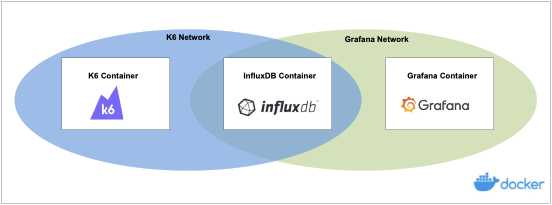

# Generating Performance and Reliability Insights from the Integrated docker-k6-grafana-influxdb
This prototype demonstrates how to run Trajectory Subsetter load tests with containerised instances of K6, Grafana and InfluxDB for real-time visualization of performance and reliability metric dashboard.

#### Knowledge Article
The integrated and containerized environment consisting of K6 framework, InfluxDB and Grafana offers unparallel user experience in bringing forth the visualization of load test use cases and metrics. This helps with better understanding of insights into the underlying issues of performance and reliability of software application.

K6 framework, an open-source testing framework written in Go with an embedded Javascript engine for collecting performance and reliability metric data.

K6 pairs with InfluxDB to capture metric data  as data points with a value and timestamp and store it as a timeseries.

In turn,  InfluxDB pairs with Grafana, a web dashboarding interface to help visualize metric data. This integration was simplified by Thompson, L., 2020; in his article published in The Startup.

The 3 containers are maintained by the Docker daemon process.

#### Dashboards
Grafana provides a collection of dashboard templates. The dashboard in /dashboards is adapted from the excellent K6 / Grafana dashboard template:
https://grafana.com/grafana/dashboards/2587

There are only two small modifications:
* the data source is configured to use the docker created InfluxDB data source
* the time period is set to now-15m, which I feel is a better view for most tests

#### Scripts
The script collector.js provides both custom and out-of-the-box gauge statistic metrics. These will be modified to generate more custom metrics.

#### Coding and Execution Steps
The script coll
